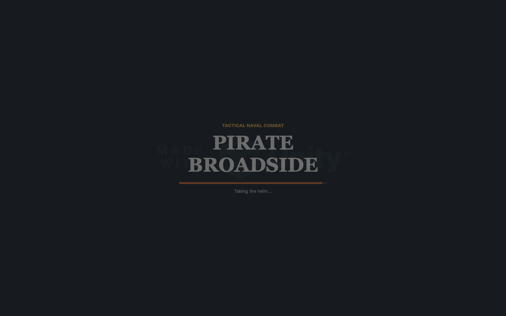
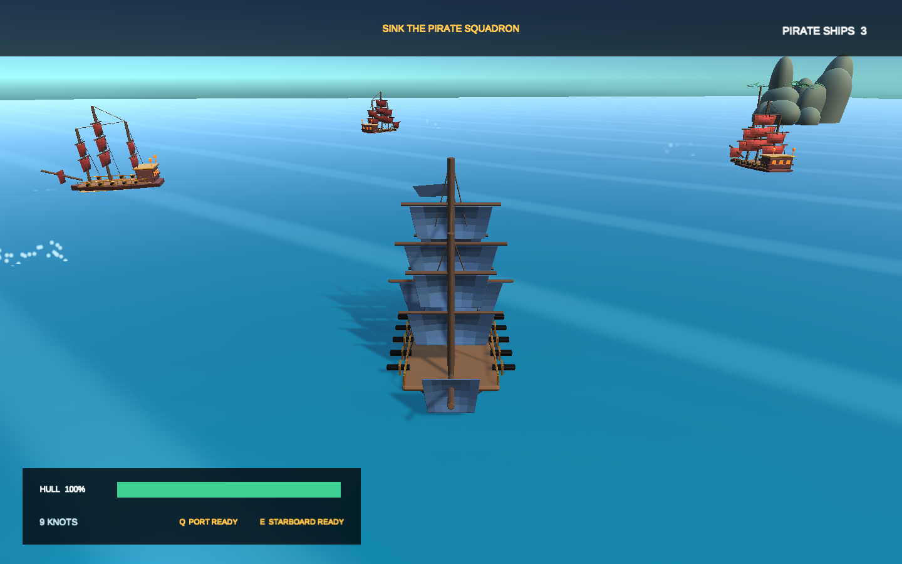

# Pirate Broadside

A fast, stylized naval combat game built with Unity 6. Command the **HMS Resolute**, maneuver for a clean firing angle, and sink a three-ship pirate squadron with timed port and starboard broadsides.

## Play

The WebGL build is published through GitHub Pages:

**https://masafykun.github.io/pirate-broadside/**

## Controls

| Action | Keyboard |
| --- | --- |
| Increase throttle | W or Up Arrow |
| Reverse / slow down | S or Down Arrow |
| Steer | A / D or Left / Right Arrow |
| Fire port broadside | Q or Left Click |
| Fire starboard broadside | E or Right Click |
| Return to menu | Esc |

## Features

- Rigidbody-based ship handling and waterline stabilization
- Independent port and starboard cannon batteries
- Three autonomous pirate ships with broadside positioning AI
- Damage, sinking, victory, defeat, and instant replay flow
- Custom animated ocean shader, islands, wakes, smoke, impacts, and procedural audio
- Original Blender-generated galleon with curved hull, sails, gun decks, rigging, and lanterns
- Responsive full-screen WebGL presentation

## Development

- Unity 6000.0.77f1
- WebGL build support
- Blender 5.1.2
- Git LFS for source art and 3D assets

Open the project in Unity and use **Pirate Broadside > Build WebGL**. The generated build is written to Build/WebGL.

## License

Source code is available under the MIT License. Original artwork and generated game assets are included for use with this project.
